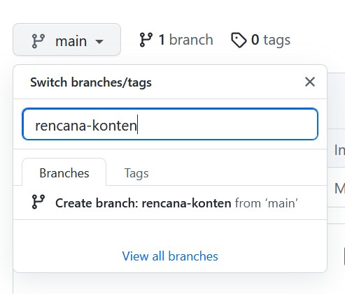
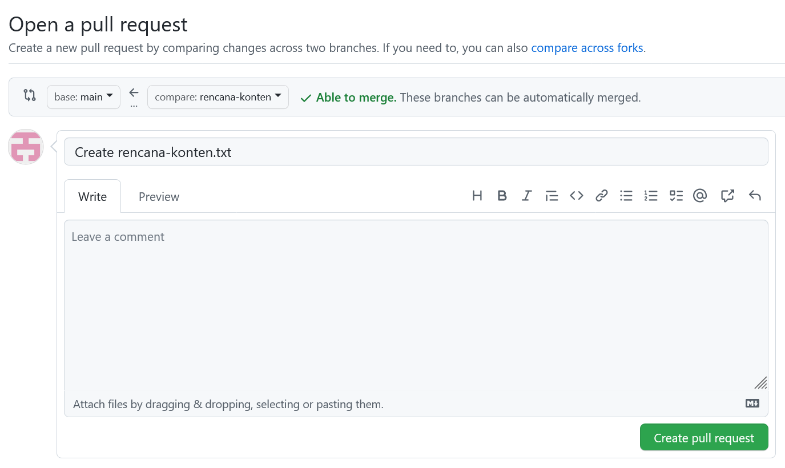
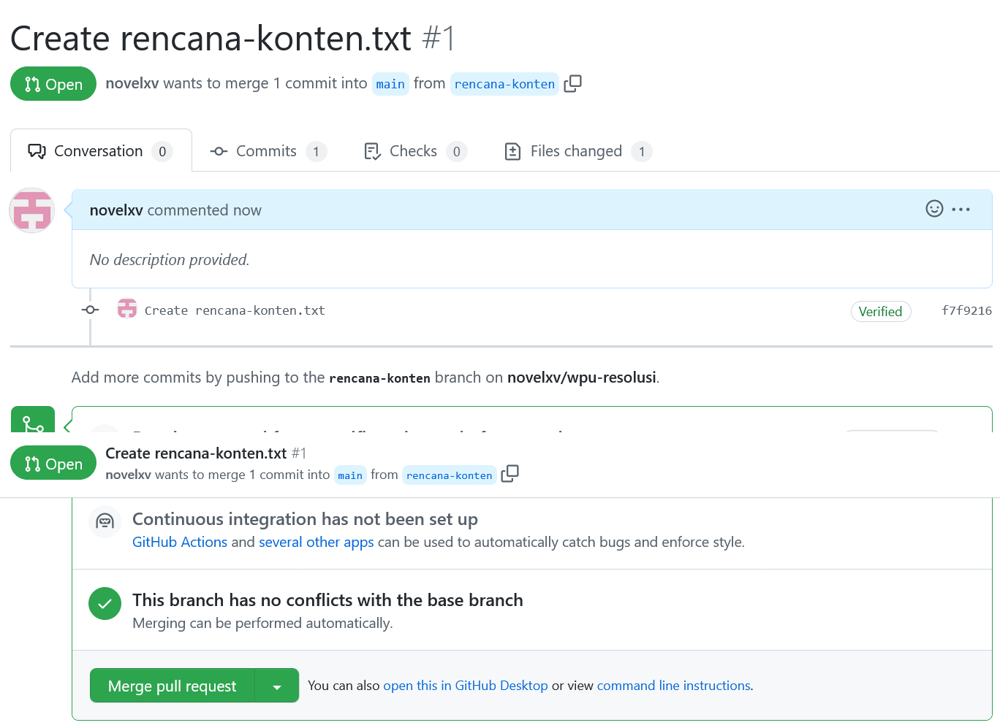

# GITHUB : BRANCH

## Branching

- Membuat Git Branch
- Membuat snapshot tanpa mengganggu jalur utama (Master branch)
- Fitur Experimental
- 2 orang mengerjakan repo yang sama

## Membuat branch baru

## Pull request

Meminta pemilik repo untuk 'mengambil' perubahan yang telah dilakukan

## Merge

Menggabungkan 2 branch

