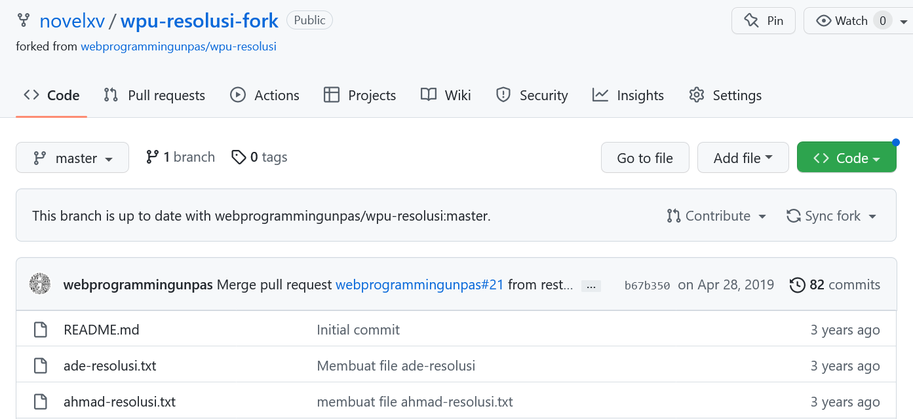

# GITHUB : FORK

## Fork/Forking

- Membuat copy/duplikat dari repo orang lain (beserta history-nya)
- Jembatan antara repo original dan duplikatnya
- Modifikasi terhadap repo original 
- Berkontribusi pada repo orang lain
- Tidak sama dengan clone

