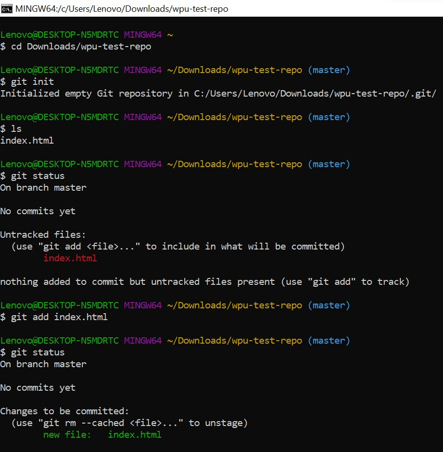
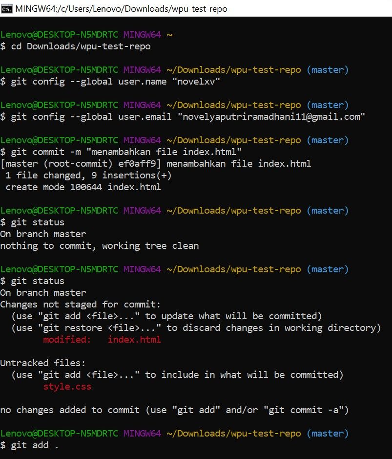
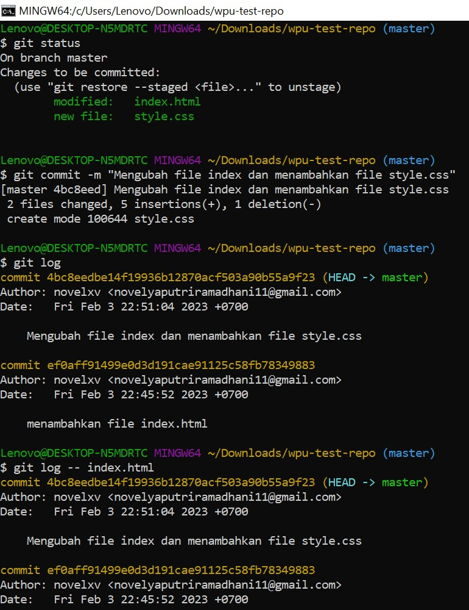
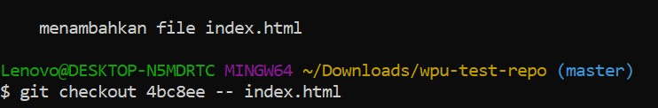

# BEKERJA DENGAN GIT

## Git Command (local)

- $ git init
- $ git add <file(s)>
- $ git status
- $ git commit
- $ git config
- $ git branch
- $ git help

## Area pada repo Git

- Working tree
- Staging area
- History

## Hands On

