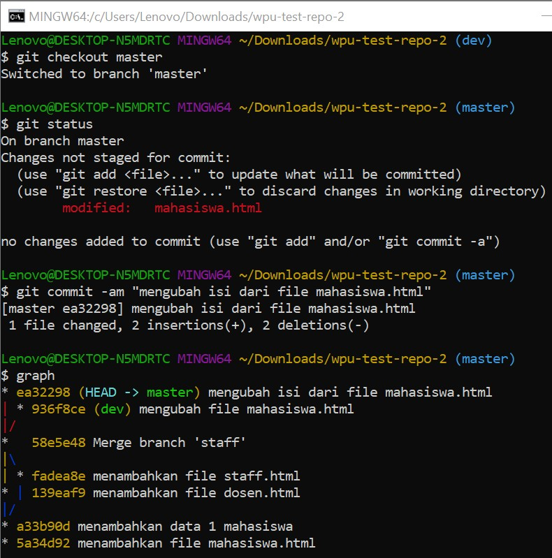

# GIT MERGE CONFLICT

Terjadi karena lebih dari satu branch mengerjakan baris yang sama dalam satu repo sehingga harus di-resolve secara manual.

## Memodifikasi sebuah file di dua branch

## Merge conflict

## Resolve confilct

## Berpindah ke commit sebelumnya dan membuat branch

